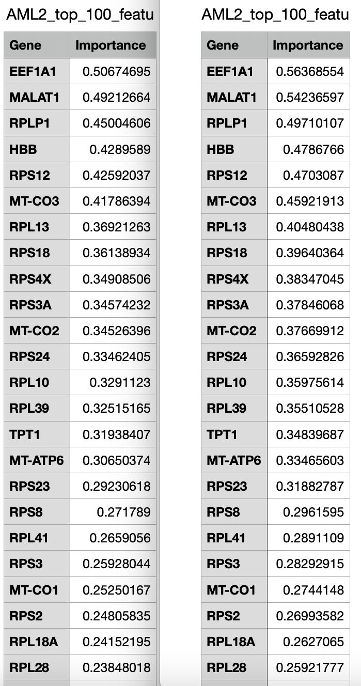
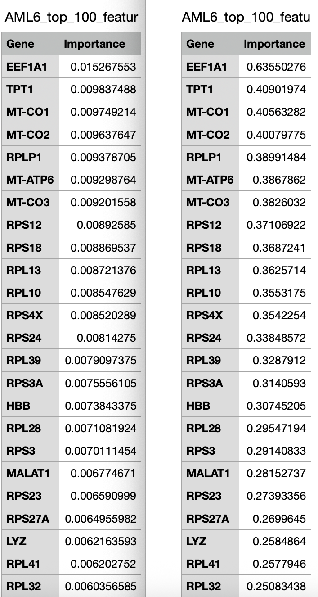
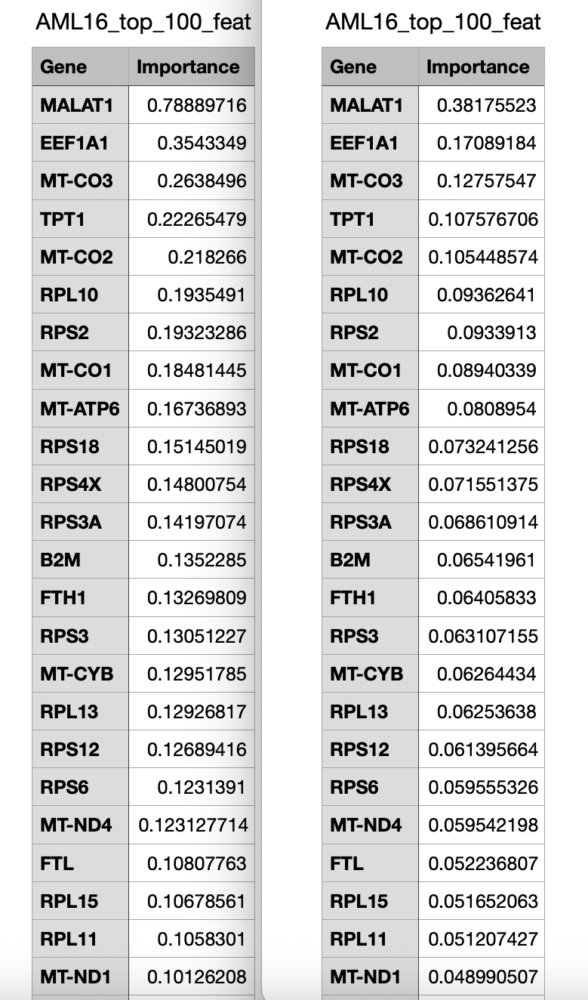

# Longitudinal-AML-in-PyTorch
Porting of the "Neurosymbolic Learning for Predicting Cell Fate Decisions from Longitudinal Single-Cell Transcriptomics in Paediatric Acute Myeloid Leukemia" [paper](https://arxiv.org/abs/2508.13199) code to PyTorch.  
**:point_right: Update November 19th 2025:  The official repository of the aforementioned paper was [here](https://github.com/Abicumaran/Longitudinal_AML), but it looks like it has been removed from GitHub. The original source code can be found in this [fork](https://github.com/virtualramblas/Longitudinal_AML). :point_left:**  
While the paper mentions that the Transformer used to  analyze temporal gene expression patterns across three time-points has been implemented in PyTorch, the source code in the companion repo contains a TensorFlow implementation of such model. The code in this repo is about a port of the model to PyTorch. In the original paper implementation, also the LSTM and bidirectional LSTM used to analyze temporal dependencies in longitudinal gene expression patterns across three states has been implemented in TensorFlow: the LSTM has been ported to PyTorch too (in scope for this repo to port the bidirectional LSTM to PyTorch next).  
# Table of contents
[Installation](README.md#installation)  
[Data Preparation](README.md#data-preparation)  
[Feature Importance with the Transformer](README.md#feature-importance-with-the-transformer)  
[Differences with the TensorFlow Implementation](README.md#differences-with-the-tensorflow-implementation)  
[Feature Importance with the LSTM](README.md#feature-importance-with-the-lstm)  
## Installation
Clone this repository first:  
```
git clone https://github.com/virtualramblas/Longitudinal-AML-in-PyTorch.git
cd Longitudinal-AML-in-PyTorch
```
Then create a Python virtual environment with your tool of choice, activate it and install the requirements listed in the ```requirements.txt``` file.  
## Data Preparation
The bulk Pediatric Leukemia Transcriptome raw data can be downloaded from [here](https://www.ncbi.nlm.nih.gov/geo/query/acc.cgi?acc=GSE7757). The total size of the compressed data on disk is 7.54 GB. This dataset includes 28 patients data that has been measured at 3 different temporal states: DX (Diagnosis), REL (Relapse), REM (Remission). Once the data has been downloaded, you need to run the two functions implemented in the ```data_preprocessing.py``` script:
* ```extract_raw_patient_data```: to extract the raw patient data from the downloaded archives.
* ```process_sparse_matrices```: to create dense DataFrames from the raw patient data sparse matrices and save them to CSV files.  
## Feature Importance with the Transformer
The Transformer model defined in ```transformer_model.py``` can be trained and used for ranking the top 100 genes by importance executing the ```transformer_training.py``` script:  
```
python transformer_training.py -h
usage: transformer_training.py [-h] [--raw_data_dir RAW_DATA_DIR] [--output_root_dir OUTPUT_ROOT_DIR]

Training a Transformer model for feature importance analysis.

options:
  -h, --help            show this help message and exit
  --raw_data_dir RAW_DATA_DIR
                        The root directory of the raw patient data.
  --output_root_dir OUTPUT_ROOT_DIR
                        The root directory where to store training metrics and results.
``` 
The script trains the model on each single patient data present in the input directory and then for each one ranks the top 100 genes by importance. Results are saved to files in the ```transformer_analysis``` sub-directory of the indicated output directory.  
## Differences with the TensorFlow Implementation
The Transformer model implementation in this repository mirrors the proposed TensorFlow implementation and the specification in the paper, and, same as for the original model, feature importance is derived by the output of the attention layer. The main difference is the number of heads of the attention layer, which has been reduced to 1 (single-head attention). This was a necessary change to satisfy a mathematical requirement of the PyTorch's ```torch.nn.MultiheadAttention``` class (the embedding dimension must be divisible by the number of heads). In this case, the embedding dimension is 1, hence the number of attention heads must be 1. The impact on performance is minimal, as each feature at each timestep is a single scalar value. With such low-dimensional embedding, there's inherently limited information for multiple attention heads to extract distinct features from. Even if we try to use more heads, they would essentially be operating on the same very simple 1-dimensional input, so the benefit of having multiple heads diminishes significantly. After training the PyTorch model on the available patient data and then using it to rank features by importance, the results for each patient matched those from the original TensorFlow model (exact same ranking), even if presenting a negligible difference in the scores (see comparison below for some of the patients, where the column on the left is releated to the PyTorch model, while the one on the right is related to the TensorFlow model):  
**Patient #2**  
  
**Patient #6**  
  
**Patient #16**  
  
## Feature Importance with the LSTM
The LSTM model defined in ```lstm_model.py``` can be trained and used for ranking the top 100 genes by importance executing the ```lstm_training.py``` script:  
```
python lstm_training.py -h
usage: lstm_training.py [-h] [--raw_data_dir RAW_DATA_DIR] [--output_root_dir OUTPUT_ROOT_DIR]

Training a LSTM model for feature importance analysis.

options:
  -h, --help            show this help message and exit
  --raw_data_dir RAW_DATA_DIR
                        The root directory of the raw patient data.
  --output_root_dir OUTPUT_ROOT_DIR
                        The root directory where to store training metrics and results.
``` 
The script trains the model on each single patient data present in the input directory and then for each one ranks the top 100 genes by importance. Results are saved to files in the ```lstm_bdm_analysisV2``` sub-directory of the indicated output directory.  